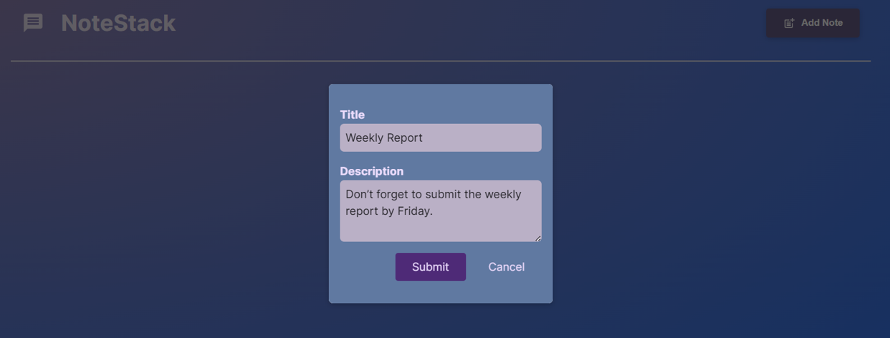
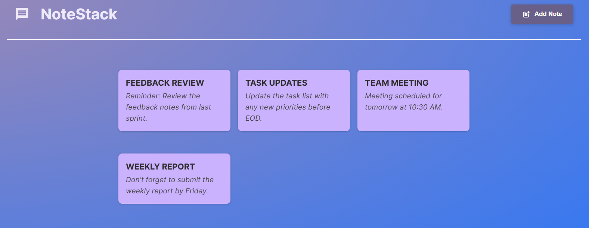

# NoteStack - React Note Maker

NoteStack is a simple note-taking app built with React and Vite.  
Users can add notes with a title and description.

---

## Features
- Create new notes with title & description
- View notes in a clean card layout
- Modal-based note creation

---

## Tech Stack
- React.js (with Hooks)
- Vite
- JavaScript (ES6+, JSX)
- HTML5 / CSS3

---

## Screenshots

### Home Page (empty state)


### Add Note (modal)


### Notes List


---

## Getting Started

To run this project locally:

```bash
# Clone this repository
git clone https://github.com/your-username/react-note-maker.git

# Navigate into the folder
cd react-note-maker

# Install dependencies
npm install

# Start development server
npm run dev
